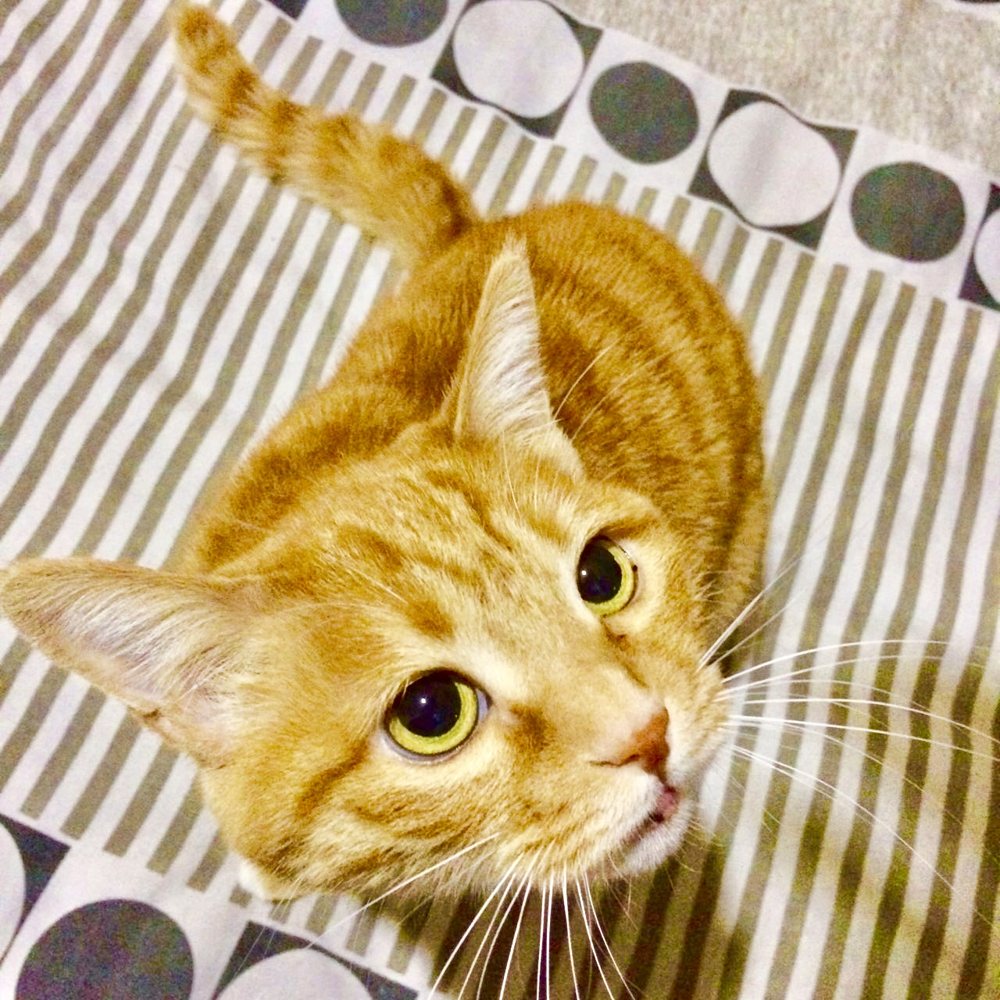

# CS 5500 Fall 2024 Template Repository 

- This is the landing page of your team.
- **Team Name:** Avec le Bon Chat
- **Team Logo:** [Place holder for a team logo]
- **Team Description:** MCGA. Make coding great again. 

## Team Members
| Image                                                              | Name      | Email                     |
|--------------------------------------------------------------------|-----------|---------------------------|
|      | Bo Pang   | pang.bo3@northeastern.edu |
|      | Steven Hu | hu.ste@northeastern.edu   |
|  | Hippo     | hippo@example.com         |
|  | Alyssa Nuanxin Jin     | shark@example.com         |

## Assigned TA
Your TA will be one of these:

| Image | Name | Email |
|-------|------|-------|
|  | Bella | xie.xinyu@northeastern.edu |
|  | Edward | Zhang.jiale2@northeastern.edu |

## Weekly Stand-Up Time
- [Place holder for the assigned time for the weekly stand up with TA]

